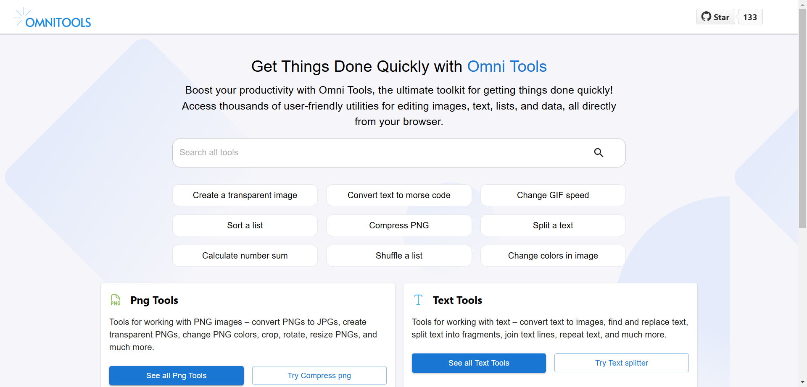

<div align="center">
        
        <br /><br />
<a href="https://trendshift.io/repositories/13055" target="_blank"></a>
   <br /><br />
<a href="https://github.com/iib0011/omni-tools/releases">
          
        </a>
        <a href="https://hub.docker.com/r/iib0011/omni-tools">
          
        </a>
        <a href="https://github.com/iib0011">
          
        </a>
        <a href="https://github.com/iib0011/omni-tools/blob/main/LICENSE">
          
        </a>
        <a href="https://discord.gg/SDbbn3hT4b">
          
        </a>
        <br /><br />
</div>

Welcome to OmniTools, a self-hosted web app offering a variety of online tools to simplify everyday tasks.
Whether you are coding, manipulating images/videos, PDFs or crunching numbers, OmniTools has you covered. Please don't
forget to
star the repo to support us.
Here is the [demo](https://omnitools.app) website.



## Table of Contents

- [Features](#features)
- [Self-host](#self-hostrun)
- [Contribute](#contribute)
- [License](#license)
- [Contact](#contact)

## Features

We strive to offer a variety of tools, including:

## **Image/Video/Binary Tools**

- Image Resizer
- Image Converter
- Video Trimmer
- Video Reverser
- And more...

## **String/List Tools**

- Case Converters
- List Shuffler
- Text Formatters
- And more...

## **Date and Time Tools**

- Date Calculators
- Time Zone Converters
- And more...

## **Math Tools**

- Generate Prime Numbers
- Generate Perfect Numbers
- And more...

## **Miscellaneous Tools**

- JSON Tools
- PDF Tools
- CSV Tools
- And more...

Stay tuned as we continue to expand and improve our collection!

## Self-host/Run

### Docker

```bash
docker run -d --name omni-tools --restart unless-stopped -p 8080:80 iib0011/omni-tools:latest
```

### Docker Compose

```yaml
services:
  omni-tools:
    image: iib0011/omni-tools:latest
    container_name: omni-tools
    restart: unless-stopped
    ports:
      - "8080:80"

```

## Contribute

This is a React Project with Typescript Material UI. We use icons from [Iconify](https://icon-sets.iconify.design)

### Project setup

```bash
git clone https://github.com/iib0011/omni-tools.git
cd omni-tools
npm i
npm run dev
```

### Create a new tool

```bash
npm run script:create:tool my-tool-name folder1 # npm run script:create:tool split pdf
```

For tools located under multiple nested directories, use:

```bash
npm run script:create:tool my-tool-name folder1/folder2 # npm run script:create:tool compress image/png
```

Use `folder1\folder2` on Windows.

### Run tests

```bash
npm run test
```

- For e2e tests

```bash
npm run test:e2e
```


## 🤝 Looking to contribute?

We welcome contributions! You can help by:

- ✅ Reporting bugs
- ✅ Suggesting new features in Github issues or [here](https://tally.so/r/nrkkx2)
- ✅ Improving documentation
- ✅ Submitting pull requests

You can also join our [Discord server](https://discord.gg/SDbbn3hT4b)

### Contributors

<a href="https://github.com/iib0011/omni-tools/graphs/contributors">
  
</a>

## Contact

For any questions or suggestions, feel free to open an issue or contact me at:
[ibracool99@gmail.com](mailto:ibracool99@gmail.com)

## License

This project is licensed under the MIT License. See the [LICENSE](LICENSE) file for details.
