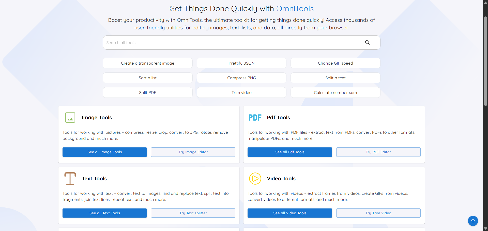

<div align="center">
  
  <br /><br />
  <h1>TechSentinel Toolbox</h1>
  <p>Une collection complète d'outils en ligne pour simplifier vos tâches quotidiennes</p>
  <br />
</div>

## 📋 À propos

**TechSentinel Toolbox** est une application web auto-hébergée offrant une variété d'outils en ligne pour simplifier vos tâches quotidiennes. Que vous travailliez avec des images, des vidéos, des PDFs, du texte ou des données, TechSentinel Toolbox vous accompagne.

**Sécurité et confidentialité** : Tous les fichiers sont traités entièrement côté client. Rien ne quitte jamais votre appareil.

**Performance** : L'image Docker est ultra-légère (28 MB), rapide à déployer et facile à auto-héberger.



## ✨ Fonctionnalités

### 🖼️ **Outils Image/Vidéo/Audio**
- Redimensionneur d'images
- Convertisseur d'images
- Éditeur d'images
- Découpe vidéo
- Inversion vidéo
- Et bien plus...

### 📄 **Outils PDF**
- Diviseur PDF
- Fusionneur PDF
- Éditeur PDF
- Et bien plus...

### 📝 **Outils Texte/Liste**
- Convertisseurs de casse
- Mélangeur de listes
- Formateurs de texte
- Et bien plus...

### 🕐 **Outils Date et Heure**
- Calculateurs de dates
- Convertisseurs de fuseaux horaires
- Et bien plus...

### 🔢 **Outils Mathématiques**
- Générateur de nombres premiers
- Calculateur de tension, courant, résistance
- Et bien plus...

### 💾 **Outils de Données**
- Outils JSON
- Outils CSV
- Outils XML
- Et bien plus...

## 🚀 Installation & Déploiement

### Docker

```bash
docker build -t techsentinel-toolbox .
docker run -d --name techsentinel-toolbox --restart unless-stopped -p 8080:3000 techsentinel-toolbox
```

### Docker Compose

```yaml
services:
  techsentinel-toolbox:
    build: .
    container_name: techsentinel-toolbox
    restart: unless-stopped
    ports:
      - "8080:3000"
```

### Déploiement Coolify

TechSentinel Toolbox est entièrement compatible avec [Coolify](https://coolify.io).

#### Démarrage rapide

1. **Créer une nouvelle application dans Coolify**
   - Type : Application
   - Source : Public Repository

2. **Configurer le dépôt**
   - URL : `https://github.com/neosoda/Tools`
   - Branche : `main`
   - Build Pack : `Dockerfile`

3. **Configurer les paramètres de déploiement**
   - Port : `3000` (interne)
   - Healthcheck Path : `/health`
   - Healthcheck Interval : `30s`

4. **Déployer**
   - Cliquez sur "Deploy"
   - Accédez à votre application via l'URL fournie

#### Variables d'environnement

| Variable | Description | Par défaut | Requis |
|----------|-------------|------------|--------|
| `PORT` | Port externe | `8080` | Non |
| `NODE_ENV` | Environnement Node | `production` | Non |
| `LOCIZE_API_KEY` | Clé API pour traductions | - | Non |

## 🛠️ Développement

### Configuration du projet

```bash
git clone https://github.com/neosoda/Tools.git
cd Tools
npm install
npm run dev
```

### Créer un nouvel outil

```bash
npm run script:create:tool mon-outil-nom dossier1
```

Pour les outils dans des répertoires imbriqués :

```bash
npm run script:create:tool compress image/png
```

### Exécuter les tests

```bash
npm run test        # Tests unitaires
npm run test:e2e    # Tests end-to-end
```

### Traductions (i18n)

Les fichiers de traduction sont disponibles dans [public/locales](public/locales).

## 🤝 Contribuer

Les contributions sont les bienvenues ! Vous pouvez aider en :

- Signalant des bugs
- Suggérant de nouvelles fonctionnalités
- Améliorant la documentation
- Soumettant des pull requests

## 📧 Contact

Pour toute question ou suggestion :
**[contact@techsentinel.fr](mailto:contact@techsentinel.fr)**

## 📜 Licence

Ce projet est sous licence MIT. Consultez le fichier [LICENSE](LICENSE) pour plus de détails.

---

<div align="center">
  <p>Développé avec ❤️ par <strong>TechSentinel</strong></p>
  <p><a href="https://techsentinel.fr">techsentinel.fr</a></p>
</div>
